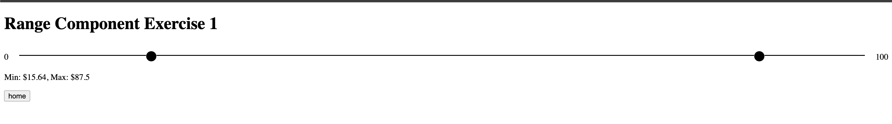
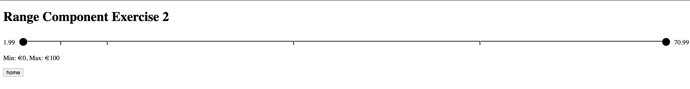

## Starting

```bash
npm i
```
Run app

```bash
npm run dev

npm test
```
# Range Component

## Objective
Evaluate your coding skills by solving an everyday coding problem based on our team's design system needs.

## Exercise
You are required to create the following component: `<Range />`. 

**Requirements:**
- Use Next.js project with appDir and TypeScript.
- Do NOT use any CLI to create the structure and architecture of your application.

**Usage Modes:**
1. Normal range from minimum to maximum number.
2. Fixed number of options ranges.

## Use Cases

### Normal Range
- Provide a `localhost:8080/exercise1` route with the following:
  - The component CANNOT be an HTML5 input range; it has to be a custom one.
  - The user can drag two handles along the range line.
  - The user can click on both the minimum and maximum number labels and set a new value.
  - The value will never be less than the minimum or greater than the maximum input values.
  - When a handle is hovered over, it should enlarge, and the cursor type should change to indicate it's draggable.
  - Dragging a handle should change the cursor to indicate dragging.
  - The minimum and maximum values cannot be crossed on the range.
  - For this example, provide a mocked HTTP service returning minimum and maximum values to be used in the component. For example: `{min: 1, max: 100}`. You can use [Mockable](https://www.mockable.io/) or a custom mocked server.
  - Implement as many unit/integration tests as possible.

### Fixed Values Range
- Provide a `localhost:8080/exercise2` route with the following:
  - The component CANNOT be an HTML5 input range; it has to be a custom one.
  - Given a range of values: `[1.99, 5.99, 10.99, 30.99, 50.99, 70.99]`, the user can only select values within this range.
  - Provide a mocked HTTP service that returns the array of numbers: `[1.99, 5.99, 10.99, 30.99, 50.99, 70.99]`. You can use [Mockable](https://www.mockable.io/) or a custom mocked server.
  - For this type of range, currency values are not input changeable; they must only be a label.
  - The user can drag two handles along the range line.
  - The minimum and maximum values cannot be crossed on the range.
  - For this example, provide a mocked service returning minimum and maximum values that have to be used in the component. For example: `{rangeValues: []}`.
  - Implement as many unit/integration tests as possible.

## Extra
- You can use any mocked method to provide service data.
- You can present your solution in any way you prefer.

### MOCK URL
- https://www.mockable.io/a/#/space/demo4889594/rest

**HAPPY CODING!**



